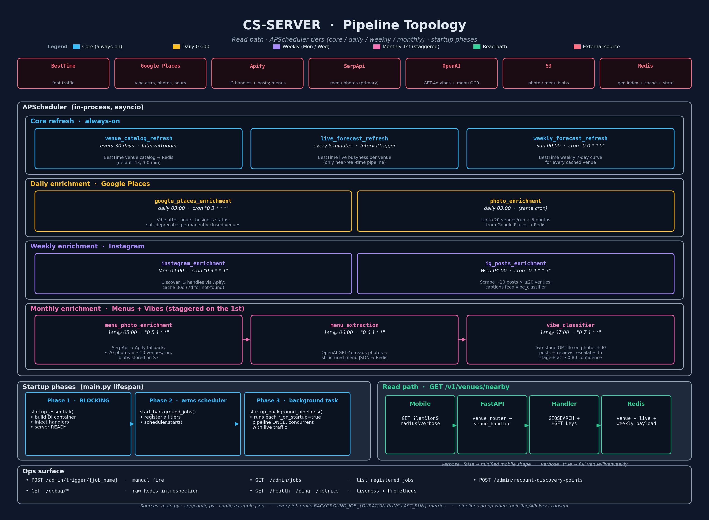

# CS-Server Pipeline Topology

- High-res raster: [pipelines.png](pipelines.png)
- Vector (zoomable): [pipelines.svg](pipelines.svg)
- Regenerate after editing: `.venv/bin/python docs/generate_pipelines_diagram.py`

## How the diagram is organized

- **Top strip** — external data sources every pipeline talks to.
- **Center block (APScheduler)** — every background job, grouped by cadence tier (core / daily / weekly / monthly).
- **Bottom left** — the three startup phases in [main.py](../main.py): essential init blocks the server, scheduled jobs are registered, then one-shot startup pipelines run as a background task concurrent with live traffic.
- **Bottom right** — the only synchronous read path: `GET /v1/venues/nearby` is served entirely from Redis, never from upstream APIs.
- **Ops surface** — admin trigger, debug, health, and Prometheus endpoints.

## Schedule cheat sheet

| Tier    | Job                         | Cadence            | Trigger                   |
| ------- | --------------------------- | ------------------ | ------------------------- |
| Core    | `venue_catalog_refresh`     | every 30 days      | Interval (43,200 min)     |
| Core    | `live_forecast_refresh`     | every 5 minutes    | Interval                  |
| Weekly  | `weekly_forecast_refresh`   | Sun 00:00          | Cron `0 0 * * 0`          |
| Daily   | `google_places_enrichment`  | Daily 03:00        | Cron `0 3 * * *`          |
| Daily   | `photo_enrichment`          | Daily 03:00        | Cron (shared)             |
| Weekly  | `instagram_enrichment`      | Mon 04:00          | Cron `0 4 * * 1`          |
| Weekly  | `ig_posts_enrichment`       | Wed 04:00          | Cron `0 4 * * 3`          |
| Monthly | `menu_photo_enrichment`     | 1st @ 05:00        | Cron `0 5 1 * *`          |
| Monthly | `menu_extraction`           | 1st @ 06:00        | Cron `0 6 1 * *`          |
| Monthly | `vibe_classifier`           | 1st @ 07:00        | Cron `0 7 1 * *`          |

Defaults come from [app/config.py](../app/config.py) and [config.example.json](../config.example.json); each job no-ops if its feature flag or API key is missing. Every run emits `BACKGROUND_JOB_DURATION_SECONDS`, `BACKGROUND_JOB_RUNS_TOTAL{status}`, and `BACKGROUND_JOB_LAST_RUN_TIMESTAMP` (see [app/metrics.py](../app/metrics.py)).
